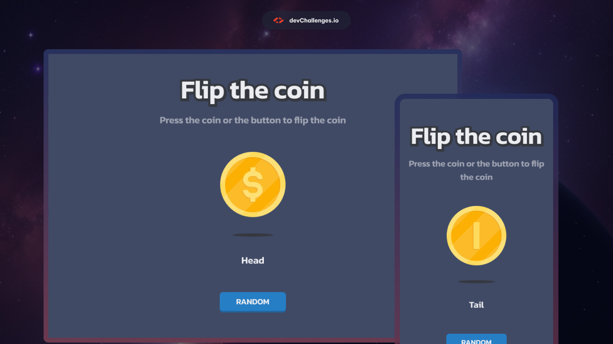
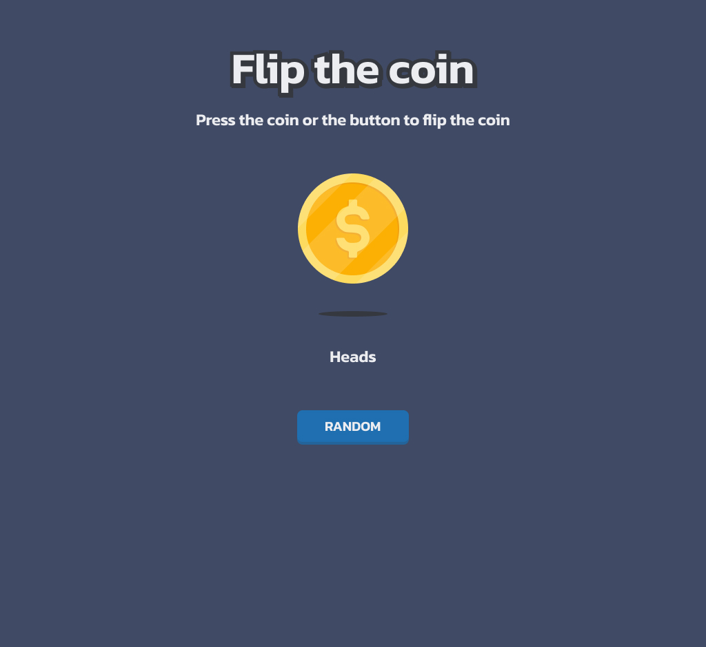

<h1 align="center">Flip The Coin Game | devChallenges</h1>

## Overview

This project is a responsive coin flip game built as part of the devChallenges.io coding challenge. The game allows users to flip a virtual coin and see animated results, with options to force specific outcomes or let chance decide.

| Desktop | Tablet | Mobile |
| ------- | ------ | ------ |
|  |  |  |

### What I learned

Working on this project helped me improve several key web development skills:

- **CSS Animations**: Implemented smooth 3D coin flip animations using CSS transforms and keyframes
- **Responsive Design**: Created layouts that work seamlessly across desktop, tablet, and mobile devices
- **JavaScript State Management**: Managed application state during animations and user interactions
- **SVG Integration**: Worked with SVG graphics for scalable, crisp coin images
- **Modern CSS**: Used flexbox for layout, CSS custom properties, and modern styling techniques

### Useful resources

- [CSS Transform Property](https://developer.mozilla.org/en-US/docs/Web/CSS/transform) - Essential for creating the 3D flip animation
- [CSS Animations Guide](https://developer.mozilla.org/en-US/docs/Web/CSS/CSS_Animations) - Helped with smooth animation timing
- [Flexbox Guide](https://css-tricks.com/snippets/css/a-guide-to-flexbox/) - Used for responsive layout design
- [Inter Font](https://fonts.google.com/specimen/Inter) - Modern, readable typography choice

## Built with

- **Semantic HTML5** markup
- **CSS3** with modern features:
  - Flexbox for layout
  - CSS Animations and Transforms
  - CSS Custom Properties
  - Responsive Media Queries
- **Vanilla JavaScript** for interactivity
- **Google Fonts** (Inter) for typography
- **SVG Graphics** for scalable coin images

## Features

This coin flip game includes the following features:

- **🎯 Interactive Coin**: Click the coin directly to trigger a random flip
- **🎮 Control Buttons**: Three buttons for different flip modes:
  - **Head**: Forces the coin to land on heads
  - **Tail**: Forces the coin to land on tails
  - **Random**: 50/50 chance for heads or tails
- **✨ Smooth Animations**: 3D coin flip animation with realistic rotation
- **📱 Responsive Design**: Optimized layouts for:
  - Desktop (1350px+)
  - Tablet (1024px)
  - Mobile (412px)
- **🎨 Clean UI**: Modern, minimalist design with professional typography
- **♿ Accessibility**: Semantic HTML and proper alt text for screen readers
- **⚡ Performance**: Lightweight, vanilla JavaScript with no external dependencies

## How to use

1. **Open the game**: Load `index.html` in your web browser
2. **Flip the coin**:
   - Click the coin directly for a random flip
   - Use the "Head" button to force heads
   - Use the "Tail" button to force tails
   - Use the "Random" button for a 50/50 chance
3. **Watch the animation**: Enjoy the smooth 3D flip animation
4. **See the result**: The result will be displayed below the buttons

## Acknowledgements

- Challenge provided by [devChallenges.io](https://devchallenges.io/)
- Coin graphics and shadow SVGs provided as part of the challenge resources
- Inter font family from [Google Fonts](https://fonts.google.com/)
